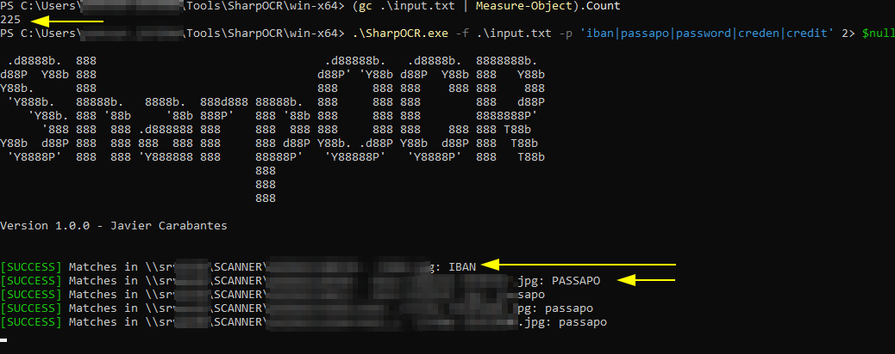

### **SharpOCR**  



SharpOCR is a command-line tool for extracting text from images and PDFs using OCR (Optical Character Recognition). It allows searching for specific patterns (e.g., passwords, financial data) within extracted text.

I originally built this tool after discovering, during an engagement, that credentials were present in a scanned document. This tool is designed more as an **audit tool** rather than a penetration testing tool due to its size and approach. It helps not only in finding credentials but also in identifying **any sensitive data** such as financial records, health information, and other confidential details.

I use it to search for patterns in a large set of images, where the file paths are listed in a text file (e.g., `images.txt`). Each line in this file should contain the full path to an image or PDF file.

---

## **Compilation & Execution**  

### **Prerequisites**  
1. Install [.NET 8.0 SDK](https://dotnet.microsoft.com/en-us/download/dotnet/8.0).  
2. Install the required dependencies:  
   ```sh
   dotnet restore
   ```
   > Note: You can manually add dependencies using: dotnet add package Tesseract and dotnet add package PdfPig

### **Compile & Run**  
To compile and execute the program, use:  
```sh
dotnet run -- -f <file_containing_images_path> -p <pattern> [-l <language>]
```  
Example:  
```sh
dotnet run -- -f images.txt -p "passw|token"
```

### **Publishing as an Executable with Dependencies**  
To generate an executable with all dependencies (without packing into a single file):  
```sh
dotnet publish -r win-x64 -c Release /p:PublishSingleFile=false /p:PublishTrimmed=true
```
This will create an executable (`SharpOCR.exe`) along with the necessary DLLs in the `bin\Release\net8.0\win-x64\publish` directory.

---

## **Usage**  

### **Preparation**
You first need to generate a file listing all image paths, for example:
```powershell
PS \\server01\scanner> gci -recurse -file -filter "*.jpg"  | select -Property FullName # copy the result into a file: images.txt
```

### **Command-Line Arguments**  
| Argument | Description |
|----------|------------|
| `-f` | Path to a text file containing a list of image/PDF file paths |
| `-p` | Regex pattern to search within extracted text |
| `-l` | Language for OCR (default: `eng`) |

Example execution:
```powershell
PS> .\SharpOCR.exe -f images.txt -p 'passw|cred' 2> $null
```

---

## **Considerations**  
- **Case-insensitive search** is applied.
- **OCR Language Support**: The tool uses **Tesseract**, and additional language models must be downloaded and placed in the `tessdata` folder.  
  - You can download additional language models (raw files) from [Tesseract's official repository](https://github.com/tesseract-ocr/tessdata) and store them in your local `tessdata` directory.  
- **Tested with decent quality scanned documents**. Results may vary with blurred, dark, or overexposed scans.  
- **Use cases**: Originally built for password searches, but can also be used for financial data extraction (IBANs, credit cards, DUNS numbers, etc.).  
- **PDF Processing Needs Refactoring**: Currently, the tool only extracts text from PDFs. Future improvements will add OCR support for embedded images in PDFs.  

---

## **To-Do List**  
- Implement **image extraction from PDFs** when no text is detected and process them with OCR.  
- Add a **verbose mode** to display parsing progress.  
